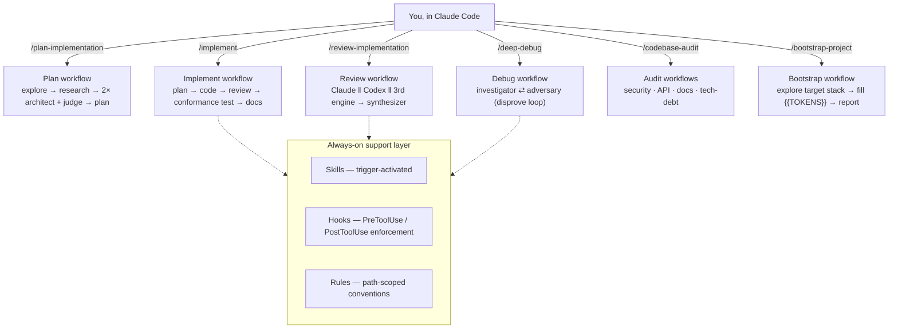
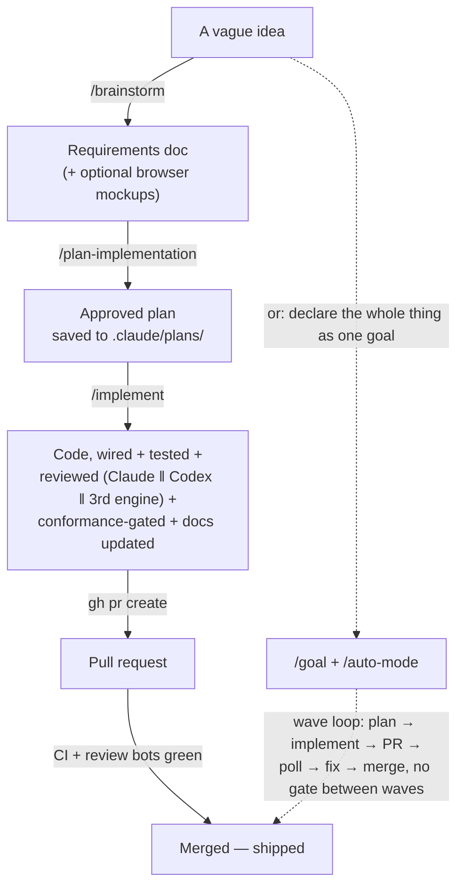

# agent-os

**A Claude Code harness that plans, implements, reviews, debugs, and audits your
codebase — and polishes the copy your users actually read — through purpose-built
multi-agent pipelines, instead of one model doing everything in one pass.** Extracted
from a production Claude Code setup running a live SaaS codebase, generalized so it
drops into any project.

It is not a framework you code against. It's a `.claude/` tree: drop it in, run
`/bootstrap-project`, and you have a working multi-agent workflow suite tuned for
disciplined, verifiable, surgical changes.

- **Agents** — 51 orchestration prompts across 8 workflows (plan · implement · review · debug · audit · copywrite · bootstrap · orchestrator)
- **Commands** — 29 slash commands, the entry points into those workflows
- **Skills** — 11 trigger-activated capabilities (Playwright testing, GitHub/PR workflows, Exa web search, branching-model conventions, and more)
- **Hooks** — 8 enforcement scripts wired into `PreToolUse`/`PostToolUse`/session-lifecycle events
- **Engine model** — Claude alone for planning/implementation; Claude + Codex dual-engine for review/debug/audits, where cross-model disagreement catches what one model misses

## Why this exists

A single LLM call planning, writing, and reviewing its own code in one pass has a
structural blind spot: it can't catch its own mistakes, because the same context
and the same biases that produced the mistake are still in the room when it checks
the work. This harness breaks that into separate, purpose-built passes with
different context, different models where it matters, and hard verification gates
between them — closer to how a real engineering team catches its own errors than to
"ask the AI and hope."

Concretely: `/plan-implementation` runs an explorer and a researcher before two
independent architects propose approaches and a judge picks (and grafts the best of
both). `/implement` writes code, then reviews it with Claude AND Codex in parallel,
plus an author-blind conformance test writer who never saw the plan being graded
against. `/review-implementation` runs three independent engines (Claude, Codex,
and a third reviewer) that don't see each other's output until a fourth agent
synthesizes them — so a finding that survives independent scrutiny from three
different vantage points is a much stronger signal than one model's opinion.

The same principle runs through the rest of the suite, not just the plan → implement →
review triangle: `/deep-debug` pairs a dual-engine investigation with a dedicated
adversary agent whose only job is to try to disprove the leading hypothesis before you
act on it. The five `/codebase-audit` deep audits (security, API contract, error paths,
docs accuracy, tech debt) apply the same cross-model-consensus idea at whole-repo
scale, with an evidence-demanding synthesizer standing between a candidate finding and
the final report. `/copywrite` runs five specialists — voice, brevity, microcopy,
localization, consistency — in a parallel-then-sequential pipeline, so user-facing copy
gets checked through several distinct lenses instead of one pass trying to catch
everything. See the "Complete workflow" diagram below, and each workflow's own
`README.md`, for the full shape of each.

**A second, orthogonal design axis: working with an LLM is inherently non-deterministic
— the same prompt can reason differently run to run — and every extra token spent is
extra cost and extra chance to drift.** Multi-agent verification (above) is how this
harness fights non-determinism at the REASONING layer — independent passes that have
to agree are a check a single non-deterministic pass can't give itself. The rest of the
harness fights the same problem at the TOOL layer: prefer deterministic, structured
tools over noisy free-form ones wherever one exists, so less has to be re-verified by a
model in the first place. `hooks/steer-bash.sh` steers off `sed -i` (silent no-ops from
platform quirks) toward the Edit tool (deterministic, reviewable); `cat`/`head`/`tail`
of code toward the Read tool (structured, cacheable, no full-file dump into context);
`ast-grep` over multi-line regex for structural code search. The same logic picks Exa
over Claude Code's native `WebSearch`/`WebFetch` (denied in `settings.json`) — see
`skills/exa/SKILL.md`'s "Why Exa" section — and picks `rg`/`difft`/`yq`/`scc` over their
default-shell equivalents (`docs/Claude-Code-Setup.md` has the full rationale table).
None of this is about avoiding LLM judgment where it's genuinely needed — it's about
not spending a model's non-deterministic reasoning on problems a deterministic tool
already solves.

**A third angle: every workflow above is a pre-decided pipeline — a human picked the
agent shape in advance.** `/orchestrate` mode covers the rest: it turns the main session
into a pure dispatcher for whatever task doesn't already have a home, matching an
existing agent first and falling back to a scoped one-off only when nothing fits — and
logging that fallback instead of throwing the signal away. `/audit-agent-gaps`
periodically clusters that log and proposes promoting a shape that keeps recurring into a
permanent agent, evidence-and-approval-gated, the same way the rest of this harness
gates everything else on verification before it counts as done. See
`agents/orchestrator/README.md`.

## Quick example — what `/implement` actually does

```
you: /implement Add rate limiting to the /api/upload endpoint

1. Planner reads the codebase, drafts a step-by-step plan with a
   backward-verification pass (does this actually close the gap?).
2. The Implementer writes the code, wires it in, and writes its own tests.
3. Two independent reviewers — Claude and Codex — review the diff in parallel,
   blind to each other's findings, then a 2-vote consensus gate decides what's
   actually a must-fix vs. a nitpick.
4. A conformance-test writer, who only ever saw the PLAN (never the diff or the
   implementer's own tests), writes behavior tests from the plan's stated intent —
   the check against "the tests all pass because the tests were written to match
   whatever the code happened to do."
5. Docs get updated, then you get a summary: what changed, what's verified, what's
   left for you to review by hand.
```

Every workflow ends with "ready for your manual testing" — agents never auto-commit
or auto-push. You stay the one who decides what ships.

## Architecture



## Complete workflow: idea to shipped

The commands above compose. Here's the full lifecycle, manual and autonomous:



The manual path stops for your approval at two hard gates (plan approach, plan review)
and again before every PR merge — you're always the one who decides what ships.
`/auto-mode` runs the identical plan → implement → review → merge spine, but for a
whole *declared goal* (a ticket with sub-issues, or a freeform objective) with no gate
between waves — see `commands/README.md` for the full wave-loop diagram. Both paths
produce the same quality bar; the difference is how much you want to watch.

## What's in the box

- **Agents** (`agents/`) — orchestration prompts for multi-step work: planning
  (explore → research → architect → plan), implementation (plan → code → review →
  verify), review (multi-engine consensus), debugging (systematic root-cause
  investigation), and audits (security, API contract, docs accuracy, tech debt).
- **Commands** (`commands/`) — the slash-command entry points that kick off those
  agent workflows: `/plan-implementation`, `/implement`, `/review-implementation`,
  `/code-review`, `/deep-debug`, `/research`, `/security-audit`, `/api-audit`,
  `/docs-audit`, `/tech-debt-audit`, `/codebase-audit`, `/copywrite`, and more.
- **Skills** (`skills/`) — reusable, trigger-activated capabilities (e.g.
  `/playwright-cli`, `/branching-model`, `/exa`, `/gh`) invoked automatically when
  a task matches their description, or explicitly via `/skill-name`.
- **Hooks** (`hooks/`) — enforcement scripts wired into `settings.json` for
  `PreToolUse`/`PostToolUse`/session-lifecycle events (steering risky bash,
  formatting on edit, re-injecting invariants, gating merges on captured
  learnings).
- **Rules** (`rules/`) — path-scoped conventions that load automatically when
  editing matching files, plus the always-on behavioral preamble
  (`rules/behavioral-preamble.md`) encoding simplicity-first, surgical-change,
  and grounded-progress-claim discipline.
- **Docs** (`docs/`) — harness-setup reference material: the Claude Code config
  layer split and env-var decision matrix (`Claude-Code-Setup.md`), the status
  line setup guide (`docs/customizations/statusline-setup.md`), a custom Linear-styled
  color theme setup guide (`docs/customizations/theme-setup.md`), a config-security
  scanner writeup for widened-autonomy postures (`config-security.md`), and the
  learned-rules-loop schema/workflow doc (`LearnedRulesLoop.md`).
- **Scripts** (`scripts/`) — standalone tooling: `bootstrap-tools.sh` (installs
  the CLI productivity layer — shellcheck, gitleaks, delta, difft, ast-grep, sd,
  yq, scc, gron, and more — across macOS/Linux), `statusline.sh` (the Claude Code
  status line), `apply-theme.sh` (installs the Linear Dark theme from `themes/`
  into `~/.claude/` and points `settings.json` at it), `brainstorm/` (the local
  server backing the `/brainstorm` skill's browser-mockup mode), `mnemosyne/`
  (the learned-rules-loop scripts), and `cron/` (reference cron wiring for the
  codebase-reindex job).
- **Prompts** (`prompts/`) — general-purpose prompt-engineering reference guides
  for Claude and OpenAI models.
- **Plugin packaging** (`plugin/agent-os-workflow/`) — the whole suite packaged
  as one versioned, toggleable Claude Code plugin, as an alternative to copying
  files directly into a project's `.claude/`.
- **Scaffold directories** — `plans/`, `research/`, `tech-debt/`, `testing/`,
  `evidence/`, `handoffs/` ship empty. They're accumulation points: agent
  workflows write into them over a project's lifetime (plans kept as history,
  research reports, tech-debt registry entries, test-plan TODOs, captured audit
  evidence, session handoff notes) so the directory itself becomes project
  history, not a rotating scratch space.

## Installing into a project

### Option A — copy the files in directly

```bash
./install.sh /path/to/target/project
```

This copies `agents/ commands/ skills/ hooks/ rules/ docs/ scripts/ prompts/
plugin/` plus the scaffold directories, `settings.json`, and
`CLAUDE.md.template` into `<target>/.claude/`. It will **not** overwrite an
existing `<target>/.claude/settings.json` or `<target>/.claude/CLAUDE.md` — if
either already exists, `install.sh` prints a warning and skips it rather than
clobbering project-specific customization.

### Option B — load it as a plugin (no files copied)

```bash
claude --plugin-dir .claude/plugin/agent-os-workflow
```

Inert by default (the plugin's component directories are symlinks into the
loose layout in this repo). **Namespacing caveat:** commands loaded via the
plugin get prefixed with the plugin name — `/implement` becomes
`/agent-os-workflow:implement`, `/auto-mode` becomes
`/agent-os-workflow:auto-mode`, and so on. See
`plugin/agent-os-workflow/README.md` for the full behavior delta (including a
subagent-frontmatter restriction under plugin loading) and the cutover path if
you later want the plugin form to be the primary layout in a project.

## After installing

Run `/bootstrap-project` inside Claude Code, in the target project. It
auto-detects the project's stack (frontend/backend/DB/hosting, package manager,
test/lint/typecheck commands) and fills in the harness's `{{TOKEN}}`
placeholders across `CLAUDE.md` (rename from `CLAUDE.md.template`),
`settings.json`, and any optional hooks that need project-specific paths or
commands.

Also run `scripts/bootstrap-tools.sh` once per machine (`--dry-run` first to preview)
— it installs the CLI productivity layer (`rg`, `sd`, `ast-grep`, `difft`, `yq`, `gron`,
`scc`, and more) that `hooks/steer-bash.sh` partly enforces and the rest of the harness
assumes is present. See `docs/Claude-Code-Setup.md` for the full setup reference
(config-layer split, env vars, the CLI tool-routing rationale, and the Mac/Linux
bring-up sequence).

## Directory structure

See [`agents/README.md`](agents/README.md) for the full agent-suite index (with a
`README.md` + diagram per workflow: [`plan`](agents/plan/README.md),
[`implementation`](agents/implementation/README.md),
[`review-implementation`](agents/review-implementation/README.md),
[`debug`](agents/debug/README.md), [`codebase`](agents/codebase/README.md),
[`copywrite`](agents/copywrite/README.md), [`bootstrap`](agents/bootstrap/README.md),
[`orchestrator`](agents/orchestrator/README.md)),
[`commands/README.md`](commands/README.md) for every slash command grouped by workflow
(plus diagrams for `/auto-mode`'s wave loop and `/research`'s fan-out),
[`hooks/README.md`](hooks/README.md) for the enforcement-hook mechanism and what's
wired vs. optional, [`rules/README.md`](rules/README.md) for the path-scoped-rules
pattern, [`scripts/README.md`](scripts/README.md) for the standalone tooling index,
[`skills/README.md`](skills/README.md) for which skills were dropped as project-specific
(with examples for your own project) and how claude.ai-managed connectors fit in,
[`docs/Claude-Code-Setup.md`](docs/Claude-Code-Setup.md) for the harness-setup
reference — including the CLI tool-routing table (`rg`/`sd`/`ast-grep`/`difft`/`yq`/
`gron`/`scc` and why each replaces a default habit) behind `scripts/bootstrap-tools.sh`
and `hooks/steer-bash.sh` — and [`plugin/agent-os-workflow/README.md`](plugin/agent-os-workflow/README.md)
for the plugin-packaging details.

| Directory    | Purpose                                                                                   |
| ------------ | ------------------------------------------------------------------------------------------ |
| `agents/`    | Orchestration prompts for complex multi-step tasks                                        |
| `commands/`  | Slash commands that kick off agent workflows                                              |
| `skills/`    | Reusable, trigger-activated capabilities                                                  |
| `hooks/`     | Enforcement scripts wired into `settings.json`                                             |
| `rules/`     | Path-scoped conventions loaded automatically for matching files                           |
| `docs/`      | Harness reference docs (setup, security posture, statusline, learned-rules schema)         |
| `scripts/`   | Standalone tooling used by hooks/commands/cron                                            |
| `prompts/`   | Prompt-engineering reference guides                                                       |
| `plugin/`    | The whole suite packaged as a toggleable Claude Code plugin                                |
| `plans/`     | Implementation plans — accumulate as project history, not deleted after use               |
| `research/`  | Research reports (topic deep-dives, library comparisons)                                  |
| `tech-debt/` | Tech debt registry from reviews/audits/manual findings                                    |
| `testing/`   | Test plan TODO for supervised test writing                                                |
| `evidence/`  | Captured evidence artifacts (screenshots, logs, reports) from audits/reviews               |
| `handoffs/`  | Session handoff notes between agents or sessions                                          |
| `orchestrator/` | `/orchestrate` mode's gap log (`GapLog.md` + `gaps.jsonl`), clustered by `/audit-agent-gaps` |
| `themes/`    | Custom Claude Code color themes (Linear Dark) — installed via `scripts/apply-theme.sh`     |

## Mnemosyne MCP integration (optional)

Several skills/rules in this harness reference a "Mnemosyne" MCP stack — a
memory MCP (durable cross-session memory), a codebase MCP (semantic code
search/orientation), and a secrets MCP (managed secret store). This repo ships
only the **client-side wiring**: the skill docs, the tool-routing guidance, and
(if you adopt it) the learned-rules-loop scripts that read/write your own
project's Postgres. The actual MCP servers are a separate project you run
yourself — see your Mnemosyne server project's own README for setup and
deployment ([nodera-studio/mnemosyne-local](https://github.com/nodera-studio/mnemosyne-local)
is a compatible local-only bootstrap). If you don't run that stack, the
corresponding skills/hooks simply won't have anything to talk to; nothing else
in this harness depends on them.

## License

[MIT](LICENSE)
