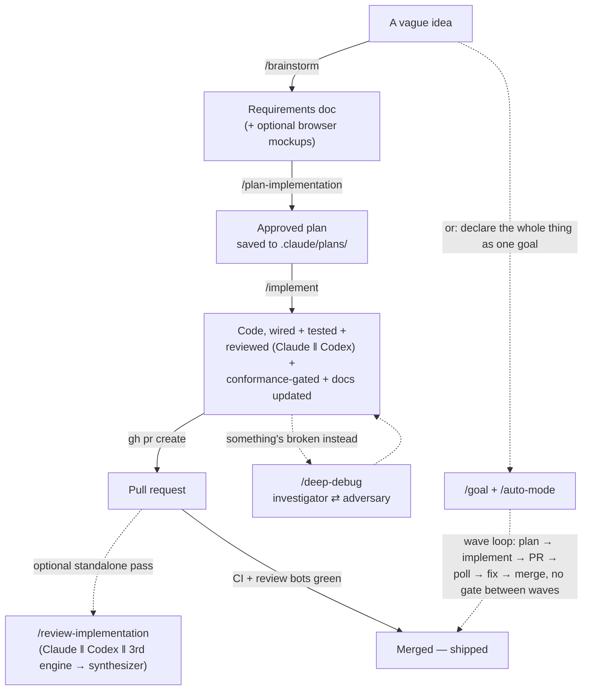

# Agent Suite

A reusable Claude Code agent suite — dispatched agents across 8 workflows — frontier roles ride `model: inherit`
(whatever the session's top model is), mechanical/summarization roles stay pinned `sonnet`.
Organized by **what you're doing** (workflow), not by technical domain. Drop this
`.claude/agents/` directory into any project; run `/bootstrap-project` (see the Bootstrap
workflow below) once to adapt the templated files to that project's actual stack.

**Engine strategy:**

- **Claude + Codex** (dual-engine) for review comprehensive passes, debug agents, and codebase audits — multi-pass voting with cross-model consensus catches issues a single model misses
- **Claude only** for planning, orchestrators, testing, error handling, docs, and all implementation stages EXCEPT the lean code-review gate inside `/implement` (1 Claude + 1 Codex pass, 2-vote)
- Codebase audits use dual-engine (Claude + Codex) per group. Security audit additionally uses checklist perturbation.
- **Model rides the session, not a hardcoded tier.** Every frontier role — orchestrators, planner/architect, the Implementer, reviewers, security/error finders, the debug investigator + adversary, research, and copywrite voice — is `model: inherit`, so it runs on whatever the session runs. Never pin a frontier agent to a model that won't follow the session. Mechanical / summarization roles (test-runner, verifier, docs-updater, light audits, plan explorer/researcher, line/microcopy/consistency editors) stay pinned `sonnet` — they don't need frontier compute. Effort: `high` is the default; `xhigh` is reserved for the Implementer, planner, and orchestrators on hard waves.

**Core principle:** The user is ALWAYS in the driver's seat. Agents do the heavy lifting (research, code, review) but NEVER take autonomous actions on git or external systems. No auto-commits, no auto-pushes. Every workflow ends with "ready for your manual testing."

---

## Directory Structure

```
.claude/agents/
│
├── README.md                        # THIS FILE — index of all agents
│
├── brainstorm.md                    # Creative exploration — vague ideas → requirements docs
│
├── bootstrap/                       # Workflow: Onboard this harness onto a new project
│   └── orchestrator.md              # Explore → research → confirm with user → fill in {{TOKEN}}s → report follow-ups
│
├── research/                        # Standalone research (user-facing, not pipeline)
│   └── agent.md                     # Context7 + web search + Playwright — saves to .claude/research/
├── local-ci.md                      # Full CI pipeline (format, lint, typecheck, build, test)
├── respond-to-review.md             # PR review response — verify claims, draft responses
│
├── implementation/                  # Workflow: Build a feature/fix (4 roles)
│   ├── orchestrator.md              # Pipeline manager: Codex Implementer → Review → tail → re-index
│   ├── orchestrator-quick.md        # Fast path for small/low-risk changes — fewer gates, same quality bar
│   ├── planner.md                   # Codebase analysis, step ordering, backward verification
│   ├── coder-codex.md               # Role 1 — the fused Implementer, run in Codex (task --json --write); Claude writes no product code
│   ├── implementer.md               # Canonical fused-loop envelope coder-codex.md forwards to Codex
│   ├── code-review.md               # Role 2 — Claude reviewer (‖ Codex via codex:codex-rescue), 2-vote
│   ├── docs-updater.md              # Role 3 (tail) — updates docs after implementation
│   └── conformance-test-writer.md   # Role 3 (tail) — author-blind, plan-derived conformance gate
│
├── plan/                            # Workflow: Explore, research, architect, plan
│   ├── orchestrator.md              # Discovery triage → explore/research → dual-engine architect+judge → dual-engine plan+judge
│   ├── explorer.md                  # Deep codebase scan for related code and patterns
│   ├── researcher.md                # Context7 + web search for best practices and pitfalls
│   ├── architect.md                 # One of two parallel architects — synthesizes into 2-3 approaches with trade-offs
│   ├── judge-selector.md            # Select-then-graft: picks the stronger of two architect/planner passes
│   └── planner.md                   # Detailed plan with backward verification + wave splitting
│
├── review-implementation/           # Workflow: Self-review (triple-engine + synthesizer)
│   ├── orchestrator.md              # Branch-aware; 3 engines (Claude ‖ codex review ‖ CodeRabbit or equivalent) → synthesizer
│   ├── comprehensive-review.md      # Claude engine — all 6 domains in one pass
│   └── synthesizer.md               # Folds 3 engines: dedup + NEW/MODIFIED/PRE-EXISTING + fix plan + memory decision
│
├── debug/                           # Workflow: Heavy investigation
│   ├── investigator.md              # Claude + Codex — root cause analysis, log tracing
│   ├── adversary.md                 # Claude — adversarial hypothesis tester (disprove/confirm)
│   └── queue.md                     # Claude + Codex — background job / async pipeline tracing
│
├── codebase/                        # Workflow: Full-codebase analysis (occasional)
│   ├── orchestrator.md              # Two-tier dispatcher (quick health check / deep audits)
│   ├── dependency-audit.md          # Dependency vulnerabilities, outdated deps, licenses
│   ├── docs-expert.md               # Documentation Q&A (on-demand, not an audit) — discovers the doc layout fresh each time
│   ├── security-audit/                       # Periodic deep audit — up to 6 agents / 4 passes, ASVS 5.0 L2
│   │   ├── orchestrator.md          # cartographer → deep agents → synthesizer; union-recall + evidence-precision
│   │   ├── audit-cartographer.md    # Stage 1 — app-intent map (endpoints/authz, tenant key, domain-critical sites, PII/SSRF)
│   │   ├── access-control-idor.md   # Stage 2 dual-engine — whole-app authz, IDOR, exposure, SSRF (always runs)
│   │   ├── domain-integrity.md      # Stage 2 (project-specific SLOT — a template, not a ready agent; see its own header)
│   │   └── audit-synthesizer.md     # Stage 3 — evidence-demanding synthesis, ASVS 5.0, memory write
│   ├── error-audit/
│   │   ├── orchestrator.md          # 6-agent dual-engine (3 Claude + 3 Codex)
│   │   ├── backend.md               # Controllers/routes, services, global infra
│   │   ├── frontend.md              # Hooks, components, pages, global UI
│   │   └── queue.md                 # Background-job processors, pipeline UX, concurrency
│   ├── api-audit/
│   │   └── orchestrator.md          # 4-agent dual-engine (endpoint inventory + contract)
│   ├── docs-audit/
│   │   └── orchestrator.md          # 3-agent (2 Claude + 1 Codex stale scanner)
│   └── tech-debt-audit/
│       └── orchestrator.md          # 4-agent (3 Claude + 1 Codex)
│
└── copywrite/                       # Workflow: Polish user-facing copy to Apple voice
    ├── orchestrator.md              # Pipeline manager — dispatch, merge, gate, write
    ├── voice-editor.md              # Apple voice transfer (loads full Apple guide)
    ├── line-editor.md               # Sentence-level surgery
    ├── microcopy-specialist.md      # Buttons, toasts, errors, empty states, ICU plural quarantine
    ├── localization-editor.md       # Cross-locale cultural adaptation, defends the committed register
    ├── consistency-checker.md       # Glossary, cross-locale parity, diacritic/script gate
    ├── apple-style-guide.md         # Unabridged Apple Style Guide — voice-editor only
    ├── voice-rubric.md              # 9-rule distillation of the Apple guide
    ├── localization-register-memo.md.template  # SKELETON — fill in this project's register decision + formality pitfalls + locale invariants
    ├── brand-terms.md.template                 # SKELETON — fill in this project's canonical spellings glossary
    ├── microcopy-patterns.md        # Buttons / errors / toasts / empty states / form labels (generic examples — swap in real product vocabulary)
    └── README.md                    # Suite overview + invocation cheatsheet + pipeline diagram

└── orchestrator/                    # Workflow: /orchestrate mode -- dispatch-only + gap tracking
    ├── orchestrator-mode.md         # Governing prompt: match -> dispatch, no match -> one-off + log gap
    ├── gap-auditor.md               # Clusters gaps.jsonl, proposes promoting recurring shapes (/audit-agent-gaps)
    └── README.md                    # Suite overview + dispatch-loop diagram
```

---

## Bootstrap workflow (`/bootstrap-project`, run once per new project)

The harness ships with templated files (`{{TOKEN}}` placeholders throughout — see
`bootstrap/orchestrator.md` for the full token list) so it can be dropped into any
project without hand-editing dozens of files. `bootstrap/orchestrator.md` explores the
target repo (via the generic `Explore` agent), researches anything ambiguous (via the
`research-agent` subagent type), confirms a synthesized project profile with the user,
asks the genuine judgment calls a repo can't answer itself (Docker-first? optional
hooks? branching model?), fills in `CLAUDE.md` / `settings.json` / opted-in hooks, and
reports a follow-up punch list (credentials, repo settings, unfilled optional slots).
Run it once when adopting this harness on a new codebase; re-run it if the stack
changes significantly.

## Complete workflow: idea to shipped

The workflows below compose into one lifecycle — this is what actually happens between
"I have an idea" and "it's merged":



The manual path stops for your approval at two hard gates (plan approach, plan review)
and again before every PR merge. `/deep-debug` and the `/codebase-audit` family (below)
plug into this loop wherever something's broken or the whole repo needs a periodic
sweep, rather than sitting on the happy path. Each workflow below has its own `README.md`
with the full per-step diagram — this file is the map of how they fit together.

## Plan workflow (`/plan-implementation`)

Turns a task into an approved, backward-verified plan before any code gets written.
Discovery triage decides how much exploration a task actually needs (minimal / standard /
deep), then two independent architects propose approaches in parallel and a judge picks
the stronger one — grafting in whatever the loser got right — rather than blending two
drafts into a compromise neither would have written alone. The planner that follows does
the same dual-engine-then-judge pass for the step-by-step plan itself, plus a
goal-backward verification pass that catches missing wiring/error-handling before you ever
approve it. See `agents/plan/README.md` for the full 8-step diagram.

## Implementation workflow (`/implement`)

Builds the approved plan. The Implementer (run in Codex) writes the code, wires it in,
and writes its own tests; a lean internal review gate (1 Claude pass ‖ 1 Codex pass, 2-vote
consensus) catches must-fix issues before the tail — an author-blind conformance-test
writer (who only ever saw the plan, never the diff or the Implementer's own tests) and a
docs updater. `/implement-quick` is the same pipeline with fewer gates for small, low-risk
changes, behind a fail-safe classifier that falls back to the full path on anything
ambiguous. See `agents/implementation/README.md` for the full pipeline diagram.

## Review workflow (`/review-implementation`)

The heavy, standalone review pass — not the same machine as `/implement`'s internal gate.
Three independent engines (Claude, a second-engine diff reviewer, and a third-party review
bot if the project has one) each review the diff blind to the others' findings, then a
fourth agent synthesizes: cross-engine agreement is HIGH confidence, a single critical
finding still survives on its own. Every finding is provenance-labelled NEW / MODIFIED /
PRE-EXISTING against the merge-base, and the output is an ordered fix plan plus a
deliberate memory-write decision — not just a wall of comments. See
`agents/review-implementation/README.md` for the full diagram.

## Debug workflow (`/deep-debug`)

Root-cause investigation with a built-in check on its own conclusions: a dual-engine
investigator (Claude + Codex) proposes a hypothesis, then a dedicated adversary agent
tries to disprove it — up to 3 cycles — before you act on anything. A quick triage step
runs first so trivial bugs don't pull in the heavy machinery, and `debug/queue.md` is a
generic background-job/async-pipeline specialist you adapt to whatever queue or broker
this project actually runs. See `agents/debug/README.md` for the full diagram.

## Codebase audit workflows (`/codebase-audit` and friends)

A two-tier system for whole-repo analysis, not a per-PR gate. Tier 1 (`/codebase-audit`,
~5 min) is a quick health check — dependency issues, dead code, tech-debt signals, API
surface, doc freshness. Tier 2 is five independently-invocable deep audits (security, API
contract, error paths, docs accuracy, tech debt), each dual-engine where it matters most.
The security audit is the deepest: a cartographer builds a shared app-intent map first
(endpoints/authz, PII/SSRF surface), two stage-2 agents hunt in parallel against that map,
and an evidence-demanding synthesizer refuses to let a finding through without proof,
reporting against ASVS 5.0 L2. See `agents/codebase/README.md` for the full diagram.

## Copywriting suite (`/copywrite`)

A six-agent suite for polishing user-facing copy to Apple voice — generic across any
product's locale(s) and register. The orchestrator dispatches three stage-1 specialists
(voice + line + microcopy) in parallel, then runs `localization-editor` and
`consistency-checker` sequentially as gates. Findings merge into a report (default) or
land as edits in place (`--apply`), with three pre-write gates: ICU
`isStructurallySame()` for plural strings, Babel re-parse for TSX files, and a
locale-invariant (diacritic/script) survival check. **Before first use**, fill in
`copywrite/brand-terms.md.template` and `copywrite/localization-register-memo.md.template`
with this project's actual glossary and register decisions — the suite ships with
generic mechanism and no real per-project vocabulary baked in.

| Agent                  | Mission                                                                                             |
| ----------------------- | ---------------------------------------------------------------------------------------------------- |
| `orchestrator`         | Resolve scope, dispatch parallel triad, sequence localization + consistency, merge, gate, write     |
| `voice-editor`         | Apply Apple voice — clarity, warmth, second-person, active voice. Loads the full Apple Style Guide. |
| `line-editor`          | Sentence-level surgery — cut filler, flip passive to active, tighten cadence                        |
| `microcopy-specialist` | Buttons, toasts, errors, empty states, form labels; quarantines ICU plural strings                  |
| `localization-editor`  | Cross-locale cultural adaptation; defends this project's committed register against formality drift |
| `consistency-checker`  | Glossary enforcement, cross-locale parity, diacritic/script survival gate                           |

---

## Orchestrator mode (`/orchestrate`)

A cross-cutting mode, not a pipeline for one kind of task. While on, the main session
decomposes every request and either dispatches an existing agent/command/skill (the common
case) or spawns a scoped one-off subagent when nothing fits — logging that gap via
`.claude/scripts/orchestrator/record-gap.mjs` before reporting back. No hook enforces the
"never edit directly" rule (a hard `PreToolUse` block on Edit/Write would also block the
very subagents this mode dispatches to do the writing, since hooks can't distinguish "main
loop" from "subagent" tool calls) — it's prompt discipline, the same mechanism the rest of
the suite already relies on for "orchestrators never take autonomous git/external actions."

`/audit-agent-gaps` is the other half: periodically clusters `.claude/orchestrator/gaps.jsonl`
and proposes a permanent agent for any shape that recurred at or above the threshold
(default 3) — mirroring the human-gated promotion pattern used by the optional Mnemosyne
learned-rules loop (`.claude/scripts/mnemosyne/promote.mjs`, if you've adopted it), but
file-based with no DB dependency, so it works out of the box on any project. It reports and
stops; nothing is written to `README.md` or a new agent file until the proposal is
explicitly approved. See `agents/orchestrator/README.md` for the full loop diagram.

---

## Slash Commands

| Command                  | Workflow                                                                          | What it dispatches                                                                            |
| ------------------------ | ----------------------------------------------------------------------------------- | ----------------------------------------------------------------------------------------------- |
| `/bootstrap-project`      | Onboard this harness onto a new project (run once)                               | `bootstrap/orchestrator.md`                                                                     |
| `/research`              | Standalone research                                                               | `research/agent.md` — Context7 + web search + Playwright, saves report to `.claude/research/` |
| `/brainstorm`            | Creative exploration                                                              | `brainstorm.md`                                                                               |
| `/plan-implementation`   | Plan before coding                                                                | `plan/orchestrator.md`                                                                        |
| `/implement`             | Build features/fixes                                                              | `implementation/orchestrator.md` (includes a lean internal Claude‖Codex code-review gate)     |
| `/implement-quick`       | Fast path for small, low-risk changes                                            | `implementation/orchestrator-quick.md`                                                         |
| `/review-implementation` | Self-review (heavy, standalone)                                                   | `review-implementation/orchestrator.md`                                                       |
| `/code-review`           | Lean dual-engine review on current diff (standalone form of `/implement` Step 13) | `implementation/code-review.md` (Claude) ‖ `codex:codex-rescue`                               |
| `/codex`                 | Dispatch a task to OpenAI Codex                                                   | `.claude/skills/codex/SKILL.md` → `codex:codex-rescue` agent                                  |
| `/deep-debug`            | Heavy investigation                                                               | `debug/investigator.md` + `debug/adversary.md` (+ `debug/queue.md` for async-pipeline bugs)   |
| `/run-ci`                | CI verification                                                                   | `local-ci.md`                                                                                 |
| `/respond-to-review`     | PR response drafting                                                              | `respond-to-review.md`                                                                        |
| `/improve-prompt`        | Prompt optimization                                                               | Uses `prompts/prompt-engineering.md` guide                                                    |
| `/codebase-audit`        | Codebase analysis                                                                 | `codebase/orchestrator.md` (quick or deep mode)                                               |
| `/security-audit`        | Codebase analysis                                                                 | `codebase/security-audit/orchestrator.md` — OWASP ASVS L2                                     |
| `/error-audit`           | Codebase analysis                                                                 | `codebase/error-audit/orchestrator.md` — error path audit                                     |
| `/api-audit`             | Codebase analysis                                                                 | `codebase/api-audit/orchestrator.md` — API contract audit                                     |
| `/docs-audit`            | Codebase analysis                                                                 | `codebase/docs-audit/orchestrator.md` — documentation accuracy                                |
| `/tech-debt-audit`       | Codebase analysis                                                                 | `codebase/tech-debt-audit/orchestrator.md` — tech debt audit                                  |
| `/copywrite`             | Polish user-facing copy                                                           | `copywrite/orchestrator.md` — report mode (default) or `--apply` for in-place edits           |
| `/orchestrate`           | Toggle dispatch-only mode for arbitrary tasks                                     | `orchestrator/orchestrator-mode.md` — match an existing agent or spawn + log a scoped one-off |
| `/audit-agent-gaps`      | Cluster the gap log, propose promoting recurring shapes into permanent agents     | `orchestrator/gap-auditor.md` — report-then-approve, writes nothing until told to proceed     |

---

## Key Features

**Bootstrap (one-time per project):**

- Explore-then-research-then-ask discipline — never guesses a stack fact the repo can
  answer directly, never silently defaults a policy question a human should decide
- Confirms the synthesized project profile before writing any file
- Fills in `{{TOKEN}}` placeholders in `CLAUDE.md` / `settings.json` / opted-in hooks
  only — the rest of the agent suite resolves tokens per-invocation from the project's
  own `CLAUDE.md`, so it never drifts out of sync when the stack changes
- Reports a follow-up punch list instead of silently leaving gaps

**Implementation pipeline:**

- Session resume via `<task>` XML blocks in plan files — crash at Step 8, resume from Step 8
- Analysis paralysis guard on writing agents (7-read threshold)
- Deviation rules for coder (auto-fix trivial, STOP on architectural surprises)
- Self-check step verifies every plan step was actually implemented
- Lean dual-engine code-review gate (Step 13): 1 Claude + 1 Codex pass in parallel, 2-vote consensus + ≤2 rework cycles — separate from and much leaner than the standalone `/review-implementation`
- Plan splitting into waves for 12+ step plans (fresh context per wave)
- Fast path (`/implement-quick`) for small, low-risk changes — a fail-safe classifier gate, same quality bar, fewer gates
- Optional project-specific domain-rubric gate slot (Role 3, conditional) — wire up your own isolated-context grader for any non-numeric, structural/textual artifact class this project cares about (see `implementation/orchestrator.md`'s Role 3 note)

**Planning pipeline:**

- Discovery triage: minimal (explorer only) / standard (both) / deep (expanded research)
- Dual-engine architect (Claude ‖ Codex) + judge-selector (select-then-graft, never blend)
- Complexity-gated planner: single-engine for minimal-triage tasks, dual-engine + judge-selector otherwise
- Goal-backward verification catches missing wiring and error handling
- Dual-format plans (MD + XML) for machine-parseable status tracking

**Debug pipeline:**

- Adversarial verification loop: investigator proposes hypothesis, adversary tries to disprove it (max 3 cycles)
- Dual-engine investigation (Claude agent + Codex) with cross-reference merge
- Quick triage step before heavy agent dispatch
- Generic background-job/async-pipeline specialist (`debug/queue.md`) — adapt to whatever queue/broker system this project actually uses

**Review pipelines:**

- Triple-engine review: Claude comprehensive reviewer ‖ a second-engine diff reviewer (e.g. `codex review`) ‖ a third-party PR bot if this project has one, each blind to the others (recall)
- Synthesizer (4th Claude agent): dedupes across engines, cross-engine agreement = HIGH confidence, critical survives a single engine (precision)
- Branch-aware: detects base, reviews authored working-tree changes (incl. uncommitted)
- Provenance labelling: each finding tagged NEW / MODIFIED / PRE-EXISTING vs the merge-base
- Produces an ordered fix plan for the Implementer + a deliberate memory-write decision
- No engine re-checks lint/type/style — the deterministic gate owns that
- Fill in `comprehensive-review.md`'s and `code-review.md`'s Project Conventions blocks with this project's actual conventions before relying on either gate

**Codebase audit two-tier system:**

- Tier 1 quick health check (~5 min): lightweight agents scan for dependency issues, dead code, tech debt signals, API surface, and doc freshness
- Tier 2 deep audits: 5 standalone multi-agent audits (security, error, API, docs, tech debt) with dual-engine consensus, semi-formal reasoning, mid-thought abort, and conventions-first anchoring
- Security audit (periodic, up to 6 agents / 4 passes): cartographer → access-control/IDOR ‖ domain-integrity (project-specific slot, optional) → evidence-demanding synthesizer; ASVS 5.0 L2 as the reporting taxonomy, not the decomposition
- Each tier 2 audit is independently invocable via its own slash command
- `docs-expert.md` discovers the project's actual documentation layout fresh via Glob each time — it has no hardcoded doc map, so it never goes stale when ported to a new project

---

## Output Contract

All review agents produce findings in this format:

```markdown
#### [CRITICAL|HIGH|MEDIUM|LOW]-001: [title]

- **Severity**: CRITICAL | HIGH | MEDIUM | LOW
- **File**: `path/to/file.ts:L42-L58`
- **Issue**: [description]
- **Impact**: [what happens if unfixed]
- **Fix**: [specific approach]
- **Confidence**: HIGH | MEDIUM | LOW
```

---

## Maintenance

- Model rides the session via `model: inherit` for every frontier role; mechanical/summarization roles stay pinned `sonnet`. Don't pin a frontier agent to a specific model — inherit is what lets the suite follow the session. See the Engine strategy note at the top.
- Agents read this project's own `CLAUDE.md` dynamically — conventions live there, not hardcoded into the agent files.
- Several files ship as explicit templates (`{{TOKEN}}` placeholders, `.template` suffixes, or a "STUB — fill this in" header): `bootstrap/orchestrator.md`'s target is `CLAUDE.md`/`settings.json`; `codebase/security-audit/domain-integrity.md`; `copywrite/brand-terms.md.template` and `copywrite/localization-register-memo.md.template`. Fill these in per-project before relying on the agents that read them.
- Stack-specific checklists (`comprehensive-review.md`, `code-review.md`'s Project Conventions blocks, the error-audit agents' `<context>`/`<conventions>` blocks) ship as placeholder shapes — fill them in with this project's real conventions; project-specific invariants belong in this project's own `.claude/rules/` files, referenced from these agents, not hand-copied into every agent.
- Each agent is standalone — orchestrators are convenience, any specialist can be invoked directly
