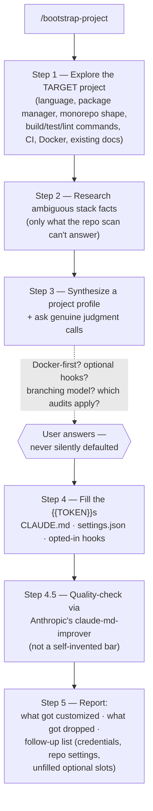

# Bootstrap Workflow

Onboards this whole harness onto a brand-new, unrelated project in one pass: learn the
target's actual stack, ask only the judgment calls a repo scan can't answer, fill in
every `{{TOKEN}}` placeholder across `CLAUDE.md`/`settings.json`/opted-in hooks, then
defer the final quality bar to Anthropic's own `claude-md-improver` rather than
inventing one. This is the command you run right after copying this repo into a new
project's `.claude/` — see the top-level `README.md`'s "After installing" section.

## Pipeline

## Why it defers to `claude-md-improver`

Steps 1-4 are the part only this harness can do — nobody else knows what a
`{{TOKEN}}` resolves to for your specific project. But "is this `CLAUDE.md` actually
good" is a solved problem Anthropic ships as a plugin (`claude-md-management`, bundling
the `claude-md-improver` skill and `/revise-claude-md` command) — Step 4.5 uses that
instead of reinventing a quality bar, and folds in suggestions without reintroducing
anything Step 3 deliberately dropped (e.g. Docker-first instructions for a Docker-absent
project).

## Files in this folder

| File | Role |
| --- | --- |
| `orchestrator.md` | The entire pipeline above — dispatches `Explore` and `research-agent`, synthesizes, asks, fills, quality-checks, reports |

## Entry point

`/bootstrap-project` — see `commands/bootstrap-project.md`. Dispatches the generic
`Explore` agent type and the `research-agent` subagent type (the same ones `/explore`
and `/research` use), so bootstrap doesn't duplicate exploration/research logic that
already exists elsewhere in the suite.

## What it does NOT do

No product code. No implementation. This is a configuration pass over the harness's own
files (`CLAUDE.md`, `settings.json`, hooks) — never the target project's actual source.
Re-run it any time the project's stack changes enough that the harness's picture is
stale (a new package manager, a monorepo split, a branching-model change).
