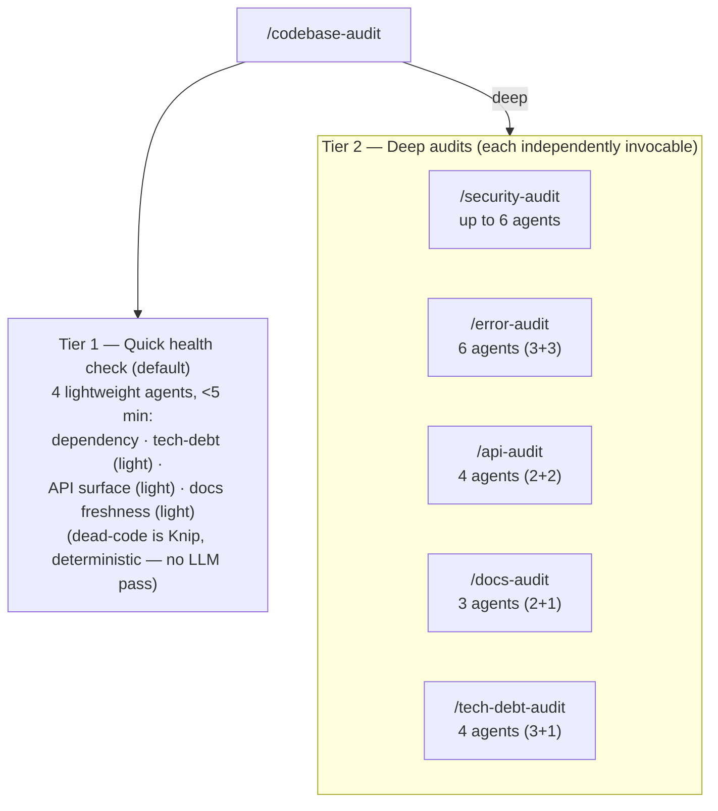
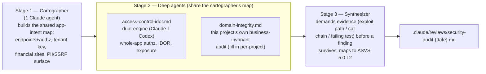

# Codebase Analysis Agents

Two-tier audit architecture for full-codebase analysis. These scan the **entire codebase**, not just diffs or individual PRs.



**Zoom: `/security-audit`'s internal shape** (the deepest of the five — cartographer →
focused deep agents → evidence-demanding synthesizer, not just N parallel scanners):



Why this shape and not 5 identical scanning passes: LLM security scans plateau at 2-3
passes (more adds false positives, not findings) and hit >50% false-positive rates
without evidence-demanding synthesis — see `security-audit/orchestrator.md`'s "Why this
shape" section for the full reasoning.

## Tier 1: Quick Health Check

Dispatched by `/codebase-audit` (default mode). Finishes in under 5 minutes.

| Agent | File | What it scans |
|-------|------|---------------|
| Dependency Audit | `dependency-audit.md` | npm vulnerabilities, outdated packages, licenses, Node.js CVEs |
| Tech Debt (light) | _(inline in orchestrator)_ | TODO/FIXME counts, `as any`, large files, empty catches |

_Dead-code detection moved to the quality gate (Knip, deterministic) — no LLM pass._
| API Surface (light) | _(inline in orchestrator)_ | Endpoint count, public endpoints, controller count |
| Docs Freshness (light) | _(inline in orchestrator)_ | Doc modification dates vs. recent source changes |

## Tier 2: Deep Audits

Each is a standalone multi-agent audit with its own orchestrator. Dispatched individually or all at once via `/codebase-audit deep`.

| Audit | Command | Directory | Agents | Engine |
|-------|---------|-----------|--------|--------|
| Security | `/security-audit` | `security-audit/` | up to 6 (cartographer → IDOR/domain-integrity → synthesizer) | Union + evidence-synth |
| Error Paths | `/error-audit` | `error-audit/` | 6 (3 Claude + 3 Codex) | Dual-engine |
| API Contract | `/api-audit` | `api-audit/` | 4 (2 Claude + 2 Codex) | Dual-engine |
| Documentation | `/docs-audit` | `docs-audit/` | 3 (2 Claude + 1 Codex) | Dual-engine |
| Tech Debt | `/tech-debt-audit` | `tech-debt-audit/` | 4 (3 Claude + 1 Codex) | Dual-engine |

## Standalone (Not Part of Audits)

| Agent | File | Purpose |
|-------|------|---------|
| Docs Expert | `docs-expert.md` | Documentation Q&A -- answers questions, not an audit |

## When to Run

| Audit | Frequency | Trigger |
|-------|-----------|---------|
| Quick health check | Weekly | After major merges, routine check-ins |
| Security audit | Quarterly | Pre-release, after auth/security changes |
| Error audit | Per feature | After major features, before error handling work |
| API audit | Per release | After API changes, pre-release |
| Docs audit | Quarterly | After major features, pre-release |
| Tech debt audit | Quarterly | Sprint planning, debt paydown sprints |

## Invocation

```bash
# Quick health check (default)
/codebase-audit

# All tier 2 deep audits
/codebase-audit deep

# Individual deep audits (standalone, no dependency on /codebase-audit)
/security-audit
/error-audit
/api-audit
/docs-audit
/tech-debt-audit

# On-demand Q&A (not an audit)
# Invoke docs-expert agent directly
```

## Research-Backed Improvements

The tier 2 audits incorporate several techniques from prompt engineering research:

- **Semi-formal reasoning:** Each agent uses a structured template (premise, execution trace, discrepancy, severity) to reduce false positives
- **Mid-thought abort:** Agents stop analyzing concerns that turn out to be handled correctly, saving context for real issues
- **Conventions-first anchoring:** Agents read project conventions (CLAUDE.md, rules/) before scanning code, reducing false positives from unfamiliar patterns
- **Evidence-demanding synthesis (security):** the synthesizer confirms each finding against an exploit path / call chain / failing pgTAP test before it ships — union for recall, evidence for precision (replaces the old checklist-perturbation passes)
- **Dual-engine consensus:** Claude and Codex agents scan independently; findings confirmed by both engines get HIGH confidence
