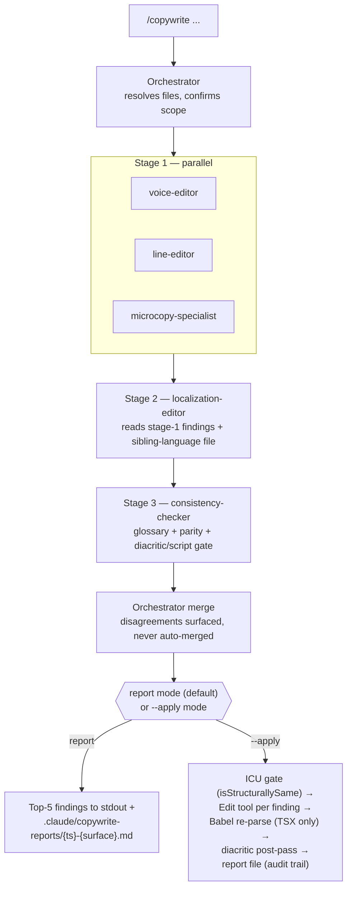

# Copywriting Suite

## What this is

A Claude Code agent suite that polishes {{PROJECT_NAME}}'s user-facing copy to Apple
voice — adapted to this project's locale(s) and register. One orchestrator dispatches
five specialists in a parallel-then-sequential pipeline and either writes a report
(default) or applies edits in place (`--apply`). Invoked via the `/copywrite` slash
command.

**Before first use:** fill in `brand-terms.md.template` and
`localization-register-memo.md.template` with this project's actual glossary and
register decisions (see each file's header), then reference them by their real names
(or drop the `.template` suffix once filled in) from `consistency-checker.md` and
`localization-editor.md`.

## Files in this folder

| File | What it is | Who loads it |
|---|---|---|
| `orchestrator.md` | Pipeline manager — dispatch, merge, write | Invoked by `/copywrite` slash command |
| `voice-editor.md` | Apple voice transfer specialist | Dispatched by orchestrator (stage 1) |
| `line-editor.md` | Sentence-level surgery specialist | Dispatched by orchestrator (stage 1) |
| `microcopy-specialist.md` | Buttons, toasts, errors, empty states, ICU plurals | Dispatched by orchestrator (stage 1) |
| `localization-editor.md` | Cross-locale register and cultural adaptation | Dispatched by orchestrator (stage 2) |
| `consistency-checker.md` | Glossary + parity + diacritic/script gate | Dispatched by orchestrator (stage 3) |
| `apple-style-guide.md` | Unabridged Apple Style Guide | `voice-editor` only |
| `voice-rubric.md` | 9-rule distillation of the Apple guide | Every specialist except `voice-editor` |
| `localization-register-memo.md.template` | Skeleton: register decision + formality-drift pitfalls + locale invariants — fill in per project | `localization-editor` and `consistency-checker` |
| `brand-terms.md.template` | Skeleton: canonical spellings glossary — fill in per project | `consistency-checker` |
| `microcopy-patterns.md` | Patterns for buttons / errors / toasts / empty states / labels | `microcopy-specialist` |

## Invocation cheatsheet

```bash
# Report mode on a single file (default — no edits land)
/copywrite {{FRONTEND_DIR}}/i18n/messages/<locale>.json --lang <locale> --surface app

# Apply mode on an email template (edits land in place, ICU + Babel gates run)
/copywrite packages/email/src/templates/trial-start.tsx --apply --surface email --register email

# Raw text mode — polish a string inline without touching files
/copywrite "Please click the button to continue." --lang en
```

## Pipeline diagram



## When NOT to use this

- **Code-only changes.** The suite is for user-visible strings. Type signatures, function bodies, configuration values — out of scope.
- **Schema and migration files.** Out of scope — column/identifier names follow this project's data-layer conventions, not copy conventions.
- **Generated files.** Anything matching `*.gen.ts`, `*.d.ts`, or auto-generated by the toolchain — never edit; regenerate the source.
- **A marketing site or other surface this project has explicitly excluded by decision.** [Note the excluded surface here, if any, and the decision that excluded it.]
- **Translated keys missing in one language.** That's an audit/consistency concern — the suite polishes existing strings, it doesn't add missing translations.
