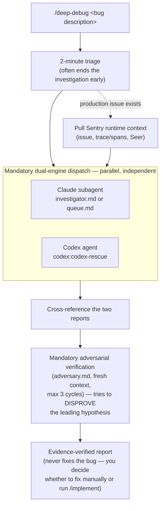

# Debug Workflow

Heavy investigation workflow for systematic root cause analysis. Not for everyday debugging -- use when you are stuck and need a methodical, exhaustive investigation.

The adversarial step is the point: a hypothesis that survives someone actively trying to
disprove it (checking it against real code and runtime evidence, not just plausibility)
is worth acting on. One that doesn't survive sends you back to investigate, cheaper than
shipping a wrong fix.

## Specialists

| Agent | File | Focus |
|-------|------|-------|
| `debug-investigator` | `investigator.md` | General application errors -- request flows, stack traces, logs, state |
| `debug-queue` | `queue.md` | Background job / async pipeline failures -- stalled jobs, stuck processing, worker issues |
| `debug-adversary` | `adversary.md` | Mandatory hypothesis-disproving pass before any root cause is reported |

## Entry Point

Invoke via `/deep-debug` slash command. Dual-engine dispatch is mandatory — cross-model
consensus is the point of this workflow, not an optional extra.

## When to Use

- A bug persists after initial investigation
- Processing is stuck with no obvious cause
- Error messages are misleading or absent
- Multiple systems interact and the failure point is unclear

## When NOT to Use

- Simple bugs with clear stack traces -- just fix them
- Configuration issues -- check `.env` files and Docker logs directly
- Known issues documented in `docs/` -- read the docs first
