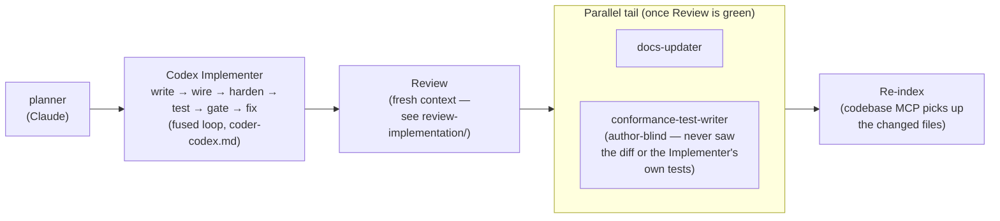

# Implementation Workflow

Automated pipeline that takes a task from specification to verified, documented,
re-indexed code. Four roles, not eighteen steps.

## Pipeline

`orchestrator-quick.md` is the fast-path variant of the same shape for small/low-risk
changes — fewer gates, same quality bar — dispatched by `/implement-quick`.

1. **planner** — Analyzes the codebase, identifies affected files, produces a numbered plan.
2. **Codex Implementer** (`coder-codex.md`) — the fused generative loop in ONE
   context, run in **Codex**: writes the code, wires every layer, hardens error
   paths, writes unit + integration tests, runs them, runs the deterministic quality
   gate (`scripts/quality-gate.sh`), and fixes every failure and finding — looping
   until tests AND the gate are green. Claude writes no product code; the context
   reading a failure is the one that wrote the code, and that context is Codex's.
   `implementer.md` is the canonical envelope `coder-codex.md` forwards to Codex.
3. **Review (fresh context)** — the triple-engine review: Claude comprehensive
   reviewer ‖ `codex review` ‖ CodeRabbit, each blind to the others, folded by the
   Claude **synthesizer** into one dedup'd, provenance-labelled report + ordered fix
   plan (the `/review-implementation` machinery; never sees the Implementer's transcript).
4. **parallel tail** — once Review is green: **docs-updater** updates docs from the
   landed code, ‖ **conformance-test-writer** runs the author-blind, plan-derived
   conformance gate (the anti-reward-hacking check).
5. **re-index** — fold the new/changed files back into the codebase MCP so semantic
   search reflects the merged code (pipeline tail + pre-push hook backstop).

## The fused Implementer runs in Codex

Claude writes no product code. The fused write→wire→harden→test→gate→fix loop runs in
**Codex** via `coder-codex.md` (`codex-companion.mjs task --json --write`), which
forwards the `implementer.md` envelope + the repo-root `AGENTS.md` conventions. The
former per-concern agents (`coder.md`, `wiring.md`, `error-handling.md`,
`test-writer.md`, `test-runner.md`, `verifier.md`, `code-simplifier.md`) were fused
into that single loop and **deleted** — do not re-create them.

## Usage

**Entry point:** `/implement` slash command, or read `orchestrator.md` directly.

The orchestrator runs in the main Claude session and dispatches each role as a
subagent via the Agent tool. Specialists cannot spawn other subagents. Large work is
split at slice boundaries (a fresh Implementer per slice/wave), never mid-loop — the
handoff is `progress.md` + the plan's `<task>` XML, never a transcript.

## Engines

**Codex writes all product code** — Role 1 (the fused Implementer) runs in Codex via
`coder-codex.md`, and Codex is also one engine of the Review gate (`codex review` /
`codex:codex-rescue`, see `.claude/skills/codex/SKILL.md`). The planner, Review
synthesizer, the parallel tail (docs-updater ‖ conformance-test-writer), and re-index
are Claude subagents on the main-loop model (Fable 5, then Opus). Claude writes no
product code.
