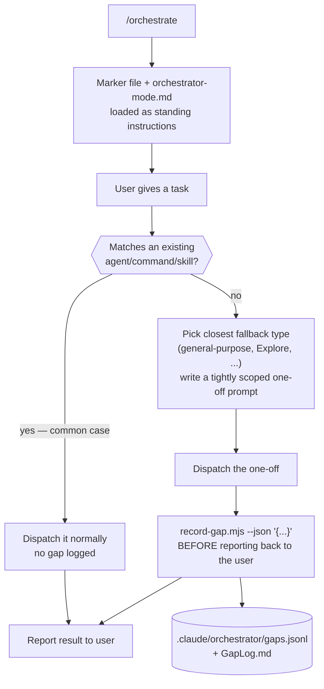
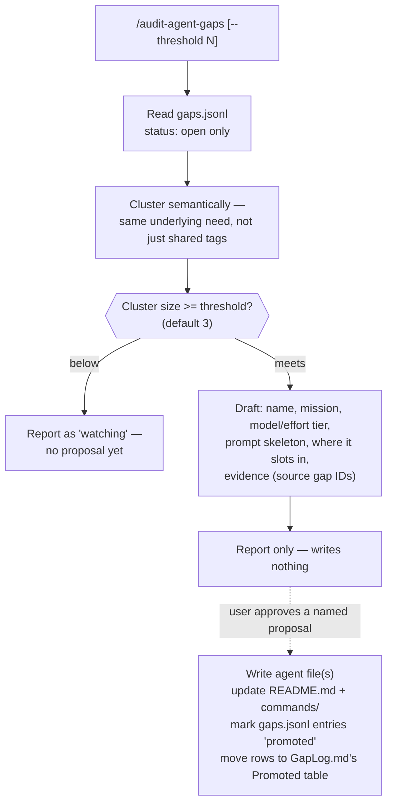

# Orchestrator Mode

Turns the main session into a pure dispatcher for arbitrary tasks: decompose, match an
existing agent from `agents/README.md` and dispatch it, or — only when nothing fits —
spawn a scoped one-off subagent and log why. The log itself becomes the input to a second,
periodic pass that decides whether a recurring one-off shape has earned a permanent place
in the suite.

## Dispatch loop

The main loop never calls Edit/Write/NotebookEdit directly in this mode — every change
goes through a dispatched agent, matched or one-off. There's no hook backing this; see
"Why prompt-level, not a hook" below.

## Gap-cluster-and-promote loop (`/audit-agent-gaps`)

## Why prompt-level, not a hook

A `PreToolUse(Edit|Write|NotebookEdit)` hard block gated on the mode marker was considered
and rejected: hooks configured in `settings.json` fire for every tool call in the session,
including calls made by the very subagents this mode dispatches to do the writing — there's
no reliable signal distinguishing "the top-level loop called this" from "a dispatched
subagent called this." A hard block would therefore also block legitimate subagent writes,
defeating the point. Enforcement is the same prompt-discipline mechanism the rest of the
suite already relies on for "orchestrators never take autonomous git/external actions" —
no new hook, no `settings.json` change, no collateral-block risk.

## Files in this folder

| File | Role |
| --- | --- |
| `orchestrator-mode.md` | Governing prompt loaded by `/orchestrate` — match-first, one-off-and-log fallback, never edit directly |
| `gap-auditor.md` | Dispatched by `/audit-agent-gaps` — clusters `gaps.jsonl`, proposes promotions, writes only on explicit approval |

## Entry points

`/orchestrate` (toggle) and `/audit-agent-gaps` (periodic review) — see
`commands/orchestrate.md` and `commands/audit-agent-gaps.md`.

## What it does NOT do

Gap logging only fires for genuine capability gaps — a task whose *kind* of work has no
harness home — not for "this particular one-off is small." A tiny fix still gets matched
normally if a fitting agent exists; it's the absence of a matching *shape*, not the size of
the task, that gets recorded. And `/audit-agent-gaps` never writes a new agent file itself
without an explicit go-ahead — the promotion bar is evidence (a recurring cluster) plus a
human decision, same as the optional Mnemosyne learned-rules loop's promotion gate.
