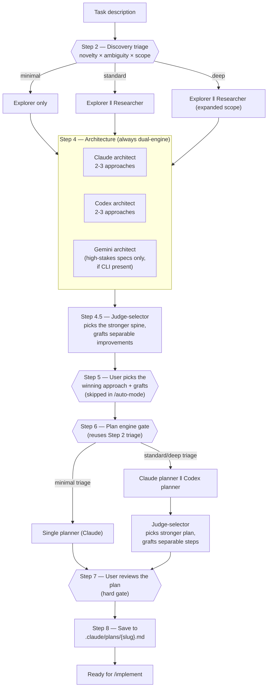

# Plan Workflow

Turns a task description into a ready-to-implement plan: explore the codebase, research
what's unfamiliar, generate competing architectures from two independent models, pick a
winner, turn it into a step-by-step plan (again from two models on harder tasks), and
save it for `/implement` to pick up. The most complex pipeline in the suite — two
distinct dual-engine-generate-then-judge-select rounds, gated by an automatic triage
step so trivial tasks don't pay for machinery they don't need.

## Why dual-engine, twice

One model proposing and reviewing its own architecture has no outside view. Two
independent models (Claude + Codex) generating from the *same* explorer/researcher
findings surface genuinely different approaches — the diversity is the value, not an
average of the two. A fresh **judge-selector**, which generated neither, picks the
stronger spine and grafts only the *separable*, low-risk improvements from the
runner-up — never blends the two into a new hybrid nobody actually designed. The same
select-then-graft pattern repeats at the plan-detail step for non-trivial tasks.

## Pipeline

## The two hard gates

Steps 5 and 7 stop for a human by default — the orchestrator never picks an approach or
finalizes a plan on your behalf. **`/auto-mode` is the one path that skips Step 5**: the
judge has already picked the base and applied only the conservative grafts (uncertain →
left out), and the orchestrator announces the choice so the unattended run stays
auditable. Step 7 (plan review) still applies inside auto-mode's per-wave pipeline —
see `../../commands/README.md` for how the wave loop drives this pipeline without a
human between waves.

## Files in this folder

| File | Role |
| --- | --- |
| `orchestrator.md` | Pipeline manager — triage, dispatch, gates, save |
| `explorer.md` | Deep codebase scan for related code, patterns, existing conventions |
| `researcher.md` | Context7 + web search for best practices, library docs, pitfalls |
| `architect.md` | One of two (or three) independent architects — 2-3 approaches with trade-offs |
| `judge-selector.md` | Select-then-graft: picks the stronger of two parallel passes, grafts separable improvements — used twice (architecture, then plan) |
| `planner.md` | Turns the chosen approach into an ordered, verifiable step plan |

## Entry point

`/plan-implementation` (standalone), or as the planning step inside `/auto-mode`'s
per-wave pipeline. Read `orchestrator.md` directly for the full step-by-step procedure.

## Engines

Explorer, researcher, single-mode planner, and the judge-selector are Claude subagents.
The architecture step is **always** dual-engine (Claude + Codex, +Gemini for high-stakes
specs if available) regardless of triage depth — it's the highest-leverage decision in
the pipeline. The plan-detail step is dual-engine only for standard/deep-triage tasks;
minimal-triage tasks get a single Claude planner and skip straight to the review gate.
