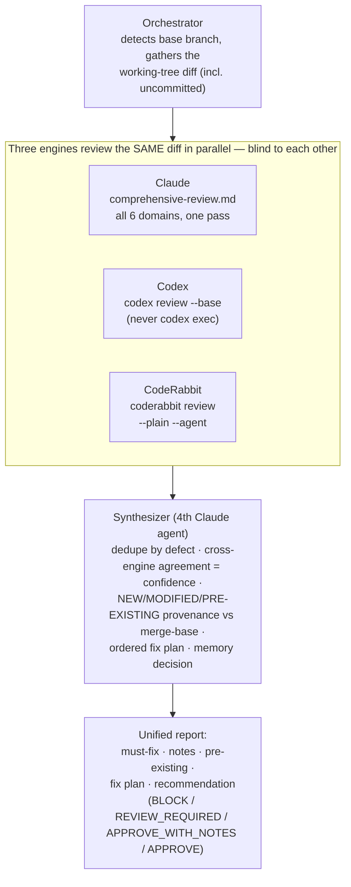

# Review Implementation Workflow (Triple-Engine + Synthesizer)

Review your own implementation before creating a PR. Three independent review engines
for recall, one synthesizer for precision. Branch-aware. Used standalone via
`/review-implementation` and inside `/implement` as Role 2 — identical machinery.

Total: 4 agents (3 engines + synthesizer) — no multi-pass voting, no shuffled diffs.

## Branch awareness

Reviews authored working-tree changes against the merge-base (default `staging`,
including uncommitted + untracked files). For branches with merge commits, the engines
see the full diff; the synthesizer flags any merge that dropped or duplicated work.

## Entry point

`/review-implementation` (standalone), or `/implement` Role 2 (in-pipeline), or read
`orchestrator.md` directly.

## Output contract

A unified report: must-fix (NEW+MODIFIED, ranked, engine-attributed) · notes
(single-engine MEDIUM/LOW) · pre-existing (informational) · an ordered fix plan · a
memory decision · and a recommendation (BLOCK / REVIEW_REQUIRED / APPROVE_WITH_NOTES /
APPROVE).
