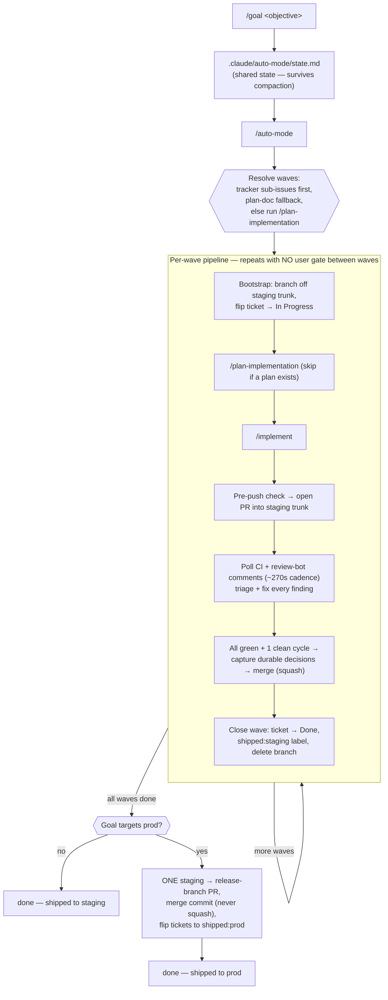
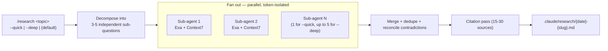

# Commands

25 slash commands, each a thin dispatcher into the agent suite under `agents/`. Grouped
here by workflow — see `agents/README.md` for the full agent-suite index each command
drives.

## Plan → build → ship

| Command | Dispatches | What it does |
| --- | --- | --- |
| `/plan-implementation` | `agents/plan/orchestrator.md` | Explore, research, dual-engine architect + judge, dual-engine plan + judge — see `agents/plan/README.md` |
| `/implement` | `agents/implementation/orchestrator.md` | Plan → Codex Implementer → triple-engine review → docs + conformance tail → re-index — see `agents/implementation/README.md` |
| `/implement-quick` | `agents/implementation/orchestrator-quick.md` | Same shape, fewer gates, for small/low-risk changes |
| `/review-implementation` | `agents/review-implementation/orchestrator.md` | Standalone triple-engine review + synthesizer on the current branch |
| `/code-review` | `agents/implementation/code-review.md` | Lean 2-engine version of the review gate, runnable standalone |
| `/respond-to-review` | `agents/respond-to-review.md` | Classify PR review comments, verify claims, draft responses, apply fixes |
| `/run-ci` | `agents/local-ci.md` | Full local CI pipeline in Docker (format, lint, typecheck, build, test) |

## Autonomous / unattended

| Command | Dispatches | What it does |
| --- | --- | --- |
| `/goal` | (writes `.claude/auto-mode/state.md`) | Declare or update the auto-mode objective + base branch — intent only, doesn't start the loop |
| `/auto-mode` | `skills/auto-mode/SKILL.md` | Drive a declared goal to merged completion, wave by wave, with no user gate in between — see the diagram below |

## Explore, research, brainstorm

| Command | Dispatches | What it does |
| --- | --- | --- |
| `/explore` | `agents/plan/explorer.md` | Deep read-only codebase exploration — map code relevant to a task |
| `/research` | `agents/research/agent.md` (fan-out) | Exa multi-agent fan-out on any topic — see the diagram below |
| `/brainstorm` | `agents/brainstorm.md` | Turn a vague idea into a requirements doc, with optional browser mockups |
| `/bootstrap-project` | `agents/bootstrap/orchestrator.md` | Onboard this harness onto a new project — see `agents/bootstrap/README.md` |

## Debug

| Command | Dispatches | What it does |
| --- | --- | --- |
| `/deep-debug` | `agents/debug/{investigator,queue}.md` + `agents/debug/adversary.md` | Dual-engine investigation + mandatory adversarial verification — see `agents/debug/README.md` |

## Codebase-wide audits

| Command | Dispatches | What it does |
| --- | --- | --- |
| `/codebase-audit` | `agents/codebase/orchestrator.md` | Tier 1 quick health check (default) or `deep` for all tier 2 audits |
| `/security-audit` | `agents/codebase/security-audit/orchestrator.md` | Cartographer → deep agents → evidence-demanding synthesizer, ASVS 5.0 L2 |
| `/error-audit` | `agents/codebase/error-audit/orchestrator.md` | 6 dual-engine agents (backend, frontend, queue) |
| `/api-audit` | `agents/codebase/api-audit/orchestrator.md` | 4 dual-engine agents — endpoint inventory, auth, validation, docs sync |
| `/docs-audit` | `agents/codebase/docs-audit/orchestrator.md` | 3 agents (2 Claude + 1 Codex) — docs vs. actual code |
| `/tech-debt-audit` | `agents/codebase/tech-debt-audit/orchestrator.md` | 4 agents (3 Claude + 1 Codex) — patterns, complexity, TODOs, library currency |
| `/security-scan` | (inline — AgentShield + mcp-scan) | Scan `.claude/` config/hooks/MCP setup for security drift |

## Copywrite

| Command | Dispatches | What it does |
| --- | --- | --- |
| `/copywrite` | `agents/copywrite/orchestrator.md` | Polish user-facing copy to Apple voice — see `agents/copywrite/README.md` |

## Codex / cross-model

| Command | Dispatches | What it does |
| --- | --- | --- |
| `/codex` | `codex:codex-rescue` (plugin agent) | Dispatch a task to OpenAI Codex |
| `/codex-advisor` | `codex:codex-rescue` (read-only) | Ask Codex for an adversarial second opinion, no edits |

## Orchestrator mode

| Command | Dispatches | What it does |
| --- | --- | --- |
| `/orchestrate` | `agents/orchestrator/orchestrator-mode.md` | Toggle dispatch-only mode — match an existing agent or spawn + log a scoped one-off — see `agents/orchestrator/README.md` |
| `/audit-agent-gaps` | `agents/orchestrator/gap-auditor.md` | Cluster the gap log, propose promoting recurring shapes into permanent agents — report-then-approve |

## Meta

| Command | Dispatches | What it does |
| --- | --- | --- |
| `/improve-prompt` | (inline — `prompts/prompt-engineering-*.md`) | Optimize a prompt or agent file against documented best practices |

---

## `/auto-mode` — the unattended wave loop

The most complex command in the suite: it drives `/plan-implementation` and
`/implement` in a loop against a declared goal, with **no user gate between waves**,
until the whole goal is merged (and promoted to your release branch, if that's what the
goal asked for).

Escalates to the user only for genuine human-required blockers (credentials, material
scope trade-offs, external approvals, a wave red 3+ cycles with no path forward) — never
just to ask "does this look right?" between waves. See `skills/auto-mode/SKILL.md` and
its `references/loop-procedures.md` for the full state-file template and escalation ladder.

## `/research` — Exa multi-agent fan-out

